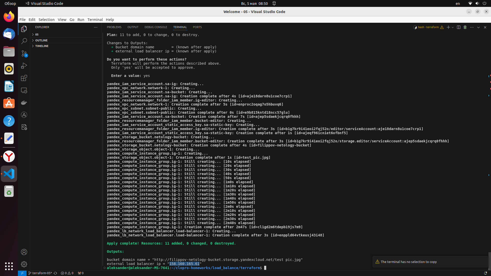
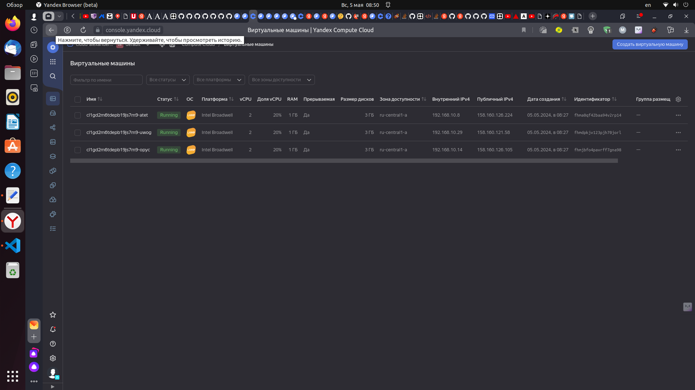
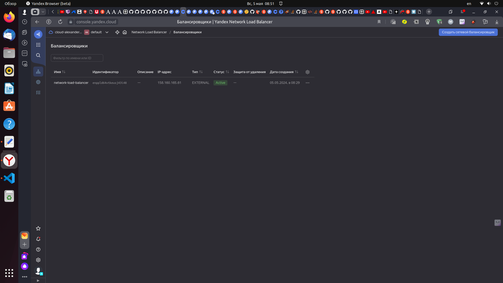
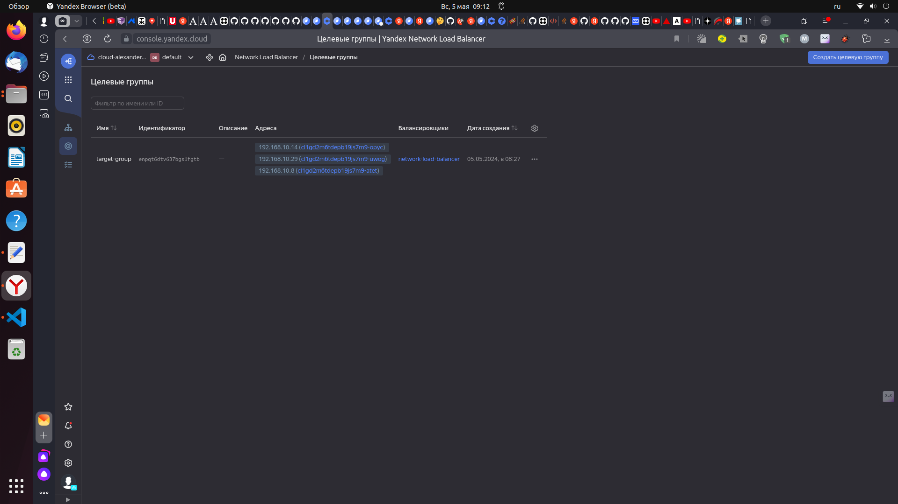
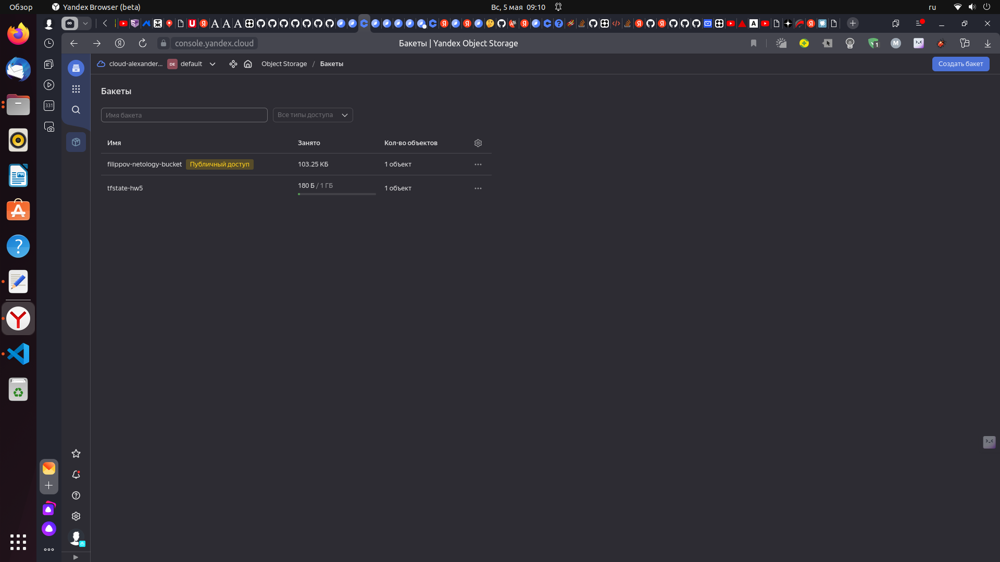
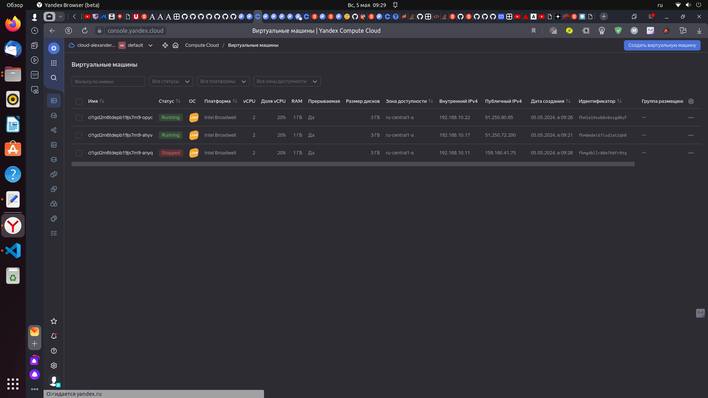
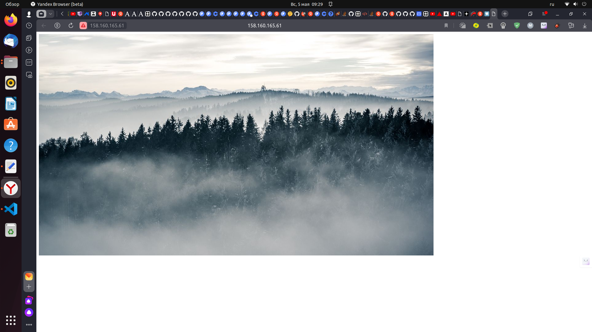

# Домашнее задание к занятию «Вычислительные мощности. Балансировщики нагрузки»  

### Подготовка к выполнению задания

1. Домашнее задание состоит из обязательной части, которую нужно выполнить на провайдере Yandex Cloud, и дополнительной части в AWS (выполняется по желанию). 
2. Все домашние задания в блоке 15 связаны друг с другом и в конце представляют пример законченной инфраструктуры.  
3. Все задания нужно выполнить с помощью Terraform. Результатом выполненного домашнего задания будет код в репозитории. 
4. Перед началом работы настройте доступ к облачным ресурсам из Terraform, используя материалы прошлых лекций и домашних заданий.

---
## Задание 1. Yandex Cloud 

**Что нужно сделать**

1. Создать бакет Object Storage и разместить в нём файл с картинкой:

 - Создать бакет в Object Storage с произвольным именем (например, _имя_студента_дата_).
 - Положить в бакет файл с картинкой.
 - Сделать файл доступным из интернета.
 
2. Создать группу ВМ в public подсети фиксированного размера с шаблоном LAMP и веб-страницей, содержащей ссылку на картинку из бакета:

 - Создать Instance Group с тремя ВМ и шаблоном LAMP. Для LAMP рекомендуется использовать `image_id = fd827b91d99psvq5fjit`.
 - Для создания стартовой веб-страницы рекомендуется использовать раздел `user_data` в [meta_data](https://cloud.yandex.ru/docs/compute/concepts/vm-metadata).
 - Разместить в стартовой веб-странице шаблонной ВМ ссылку на картинку из бакета.
 - Настроить проверку состояния ВМ.
 
3. Подключить группу к сетевому балансировщику:

 - Создать сетевой балансировщик.
 - Проверить работоспособность, удалив одну или несколько ВМ.
4. (дополнительно)* Создать Application Load Balancer с использованием Instance group и проверкой состояния.

Полезные документы:

- [Compute instance group](https://registry.terraform.io/providers/yandex-cloud/yandex/latest/docs/resources/compute_instance_group).
- [Network Load Balancer](https://registry.terraform.io/providers/yandex-cloud/yandex/latest/docs/resources/lb_network_load_balancer).
- [Группа ВМ с сетевым балансировщиком](https://cloud.yandex.ru/docs/compute/operations/instance-groups/create-with-balancer).


## Решение 1. Yandex Cloud

1. Создаем бакет Object Storage, размещаем в нём файл с картинкой c публичным доступом:

```
// Create SA
resource "yandex_iam_service_account" "sa-bucket" {
    name      = "sa-for-bucket"
}

// Grant permissions
resource "yandex_resourcemanager_folder_iam_member" "bucket-editor" {
    folder_id = var.folder_id
    role      = "storage.editor"
    member    = "serviceAccount:${yandex_iam_service_account.sa-bucket.id}"
    depends_on = [yandex_iam_service_account.sa-bucket]
}

// Create Static Access Keys
resource "yandex_iam_service_account_static_access_key" "sa-static-key" {
    service_account_id = yandex_iam_service_account.sa-bucket.id
    description        = "static access key for bucket"
}

// Use keys to create bucket
resource "yandex_storage_bucket" "netology-bucket" {
    access_key = yandex_iam_service_account_static_access_key.sa-static-key.access_key
    secret_key = yandex_iam_service_account_static_access_key.sa-static-key.secret_key
    bucket = "filippov-netology-bucket"
    acl    = "public-read"
}

// Add picture to bucket
resource "yandex_storage_object" "object-1" {
    access_key = yandex_iam_service_account_static_access_key.sa-static-key.access_key
    secret_key = yandex_iam_service_account_static_access_key.sa-static-key.secret_key
    bucket = yandex_storage_bucket.netology-bucket.bucket
    key = "test_pic.jpg"
    source = "data/test_pic.jpg"
    acl    = "public-read"
    depends_on = [yandex_storage_bucket.netology-bucket]
```
2. Создаем группу ВМ в public подсети фиксированного размера с шаблоном LAMP и веб-страницей, содержащей ссылку на картинку из бакета:

```
// Create SA
resource "yandex_iam_service_account" "sa-ig" {
    name      = "sa-for-ig"
}

// Grant permissions
resource "yandex_resourcemanager_folder_iam_member" "ig-editor" {
    folder_id = var.folder_id
    role      = "editor"
    member    = "serviceAccount:${yandex_iam_service_account.sa-ig.id}"
}

// Create instance group
resource "yandex_compute_instance_group" "ig-1" {
    name               = "fixed-ig-with-balancer"
    folder_id          = var.folder_id
    service_account_id = yandex_iam_service_account.sa-ig.id

    instance_template {
        resources {
            cores  = 2
            memory = 1
            core_fraction = 20
        }
        boot_disk {
            initialize_params {
                image_id = var.lamp-instance-image-id
            }
        }
        network_interface {
            network_id  = yandex_vpc_network.network-1.id
            subnet_ids  = [yandex_vpc_subnet.subnet-public.id]
            nat         = true
        }
        scheduling_policy {
            preemptible = true  // Прерываемая
        }
        metadata = {
            ssh-keys   = "ubuntu:${file("~/.ssh/id_rsa.pub")}"
            user-data  = <<EOF
#!/bin/bash
apt install httpd -y
cd /var/www/html
echo '<html></html>' > index.html
service httpd start
EOF
      }
   }

    scale_policy {
        fixed_scale {
            size = 3
        }
    }

    allocation_policy {
        zones = [var.default_zone]
    }

    deploy_policy {
        max_unavailable  = 1
        max_creating     = 3
        max_expansion    = 1
        max_deleting     = 1
        startup_duration = 3
    }

     health_check {
        http_options {
            port    = 80
            path    = "/"
        }
    }

    depends_on = [
        yandex_storage_bucket.netology-bucket
    ]

    load_balancer {
        target_group_name = "target-group"
    }
}
```

3. Создаем сетевой балансировщик и подключаем к нему созданную группу:

```
//Create balancer
resource "yandex_lb_network_load_balancer" "load-balancer-1" {
  name = "network-load-balancer"

  listener {
    name = "lb-listener"
    port = 80
    external_address_spec {
      ip_version = "ipv4"
    }
  }

  attached_target_group {
    target_group_id = yandex_compute_instance_group.ig-1.load_balancer[0].target_group_id

    healthcheck {
      name = "http"
      http_options {
        port = 80
        path = "/"
      }
    }
  }
  depends_on = [
    yandex_compute_instance_group.ig-1
]
}
```
4. Выполняем работу по созданию ресурсов в Yandex Cloud:

<p align="center">
  
</p>

 - в результате создались ВМ:

<p align="center">
  
</p>

 - балансировщик:

<p align="center">
  
</p>

<p align="center">
  
</p>

 - бакет с именем filippov-netology-bucket:

<p align="center">
  
</p>

5. Заходим на ip-адрес балансировщика и видим созданную картинку:

<p align="center">
  
</p>

6. Останавливаем одну ВМ:

<p align="center">
  
</p>

7. Заходим на ip-адрес балансировщика и видим созданную картинку:

<p align="center">
  
</p>

---
## Задание 2*. AWS (задание со звёздочкой)

Это необязательное задание. Его выполнение не влияет на получение зачёта по домашней работе.

**Что нужно сделать**

Используя конфигурации, выполненные в домашнем задании из предыдущего занятия, добавить к Production like сети Autoscaling group из трёх EC2-инстансов с  автоматической установкой веб-сервера в private домен.

1. Создать бакет S3 и разместить в нём файл с картинкой:

 - Создать бакет в S3 с произвольным именем (например, _имя_студента_дата_).
 - Положить в бакет файл с картинкой.
 - Сделать доступным из интернета.
2. Сделать Launch configurations с использованием bootstrap-скрипта с созданием веб-страницы, на которой будет ссылка на картинку в S3. 
3. Загрузить три ЕС2-инстанса и настроить LB с помощью Autoscaling Group.

Resource Terraform:

- [S3 bucket](https://registry.terraform.io/providers/hashicorp/aws/latest/docs/resources/s3_bucket)
- [Launch Template](https://registry.terraform.io/providers/hashicorp/aws/latest/docs/resources/launch_template).
- [Autoscaling group](https://registry.terraform.io/providers/hashicorp/aws/latest/docs/resources/autoscaling_group).
- [Launch configuration](https://registry.terraform.io/providers/hashicorp/aws/latest/docs/resources/launch_configuration).

Пример bootstrap-скрипта:

```
#!/bin/bash
yum install httpd -y
service httpd start
chkconfig httpd on
cd /var/www/html
echo "<html><h1>My cool web-server</h1></html>" > index.html
```
### Правила приёма работы

Домашняя работа оформляется в своём Git репозитории в файле README.md. Выполненное домашнее задание пришлите ссылкой на .md-файл в вашем репозитории.
Файл README.md должен содержать скриншоты вывода необходимых команд, а также скриншоты результатов.
Репозиторий должен содержать тексты манифестов или ссылки на них в файле README.md.
