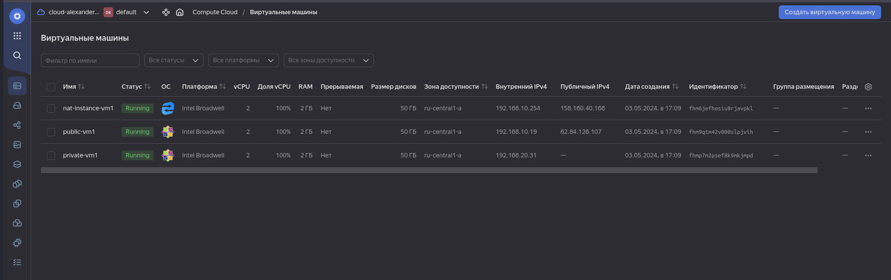
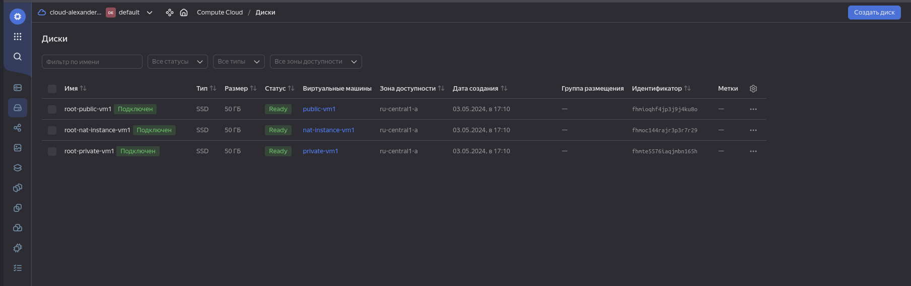
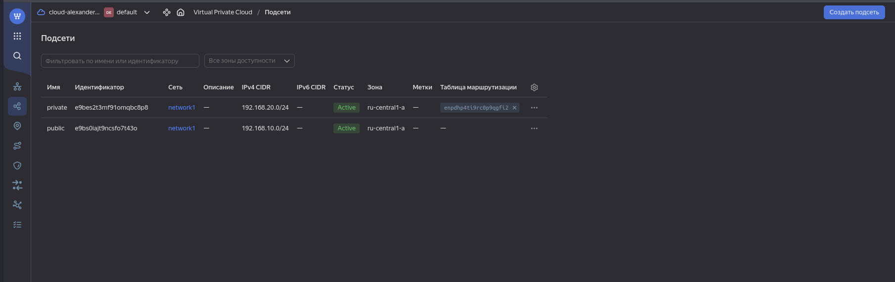
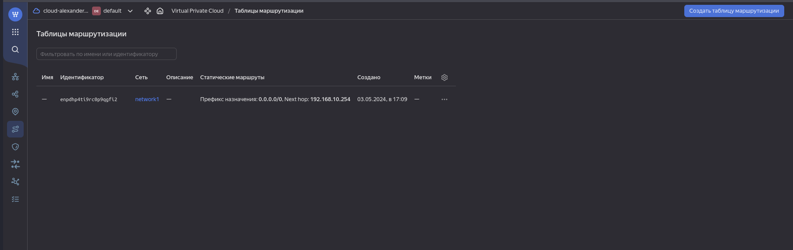
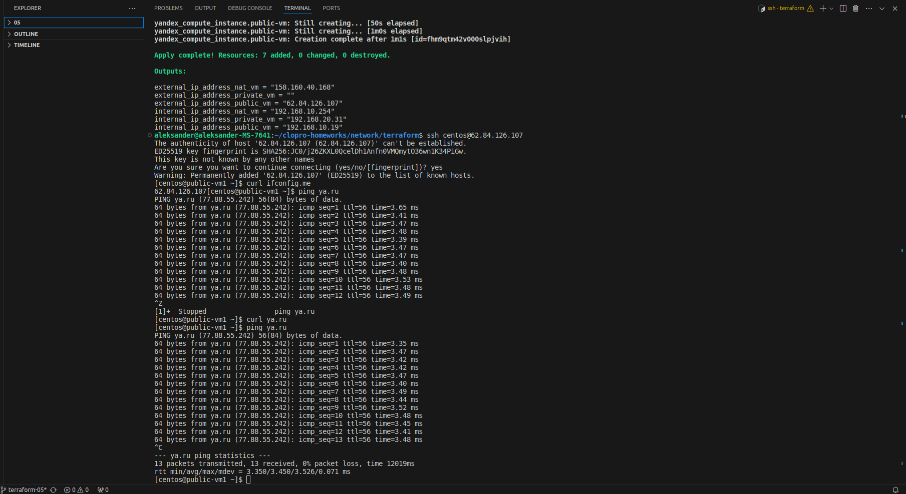
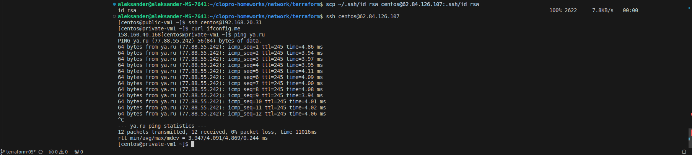

# Домашнее задание к занятию «Организация сети»

### Подготовка к выполнению задания

1. Домашнее задание состоит из обязательной части, которую нужно выполнить на провайдере Yandex Cloud, и дополнительной части в AWS (выполняется по желанию). 
2. Все домашние задания в блоке 15 связаны друг с другом и в конце представляют пример законченной инфраструктуры.  
3. Все задания нужно выполнить с помощью Terraform. Результатом выполненного домашнего задания будет код в репозитории. 
4. Перед началом работы настройте доступ к облачным ресурсам из Terraform, используя материалы прошлых лекций и домашнее задание по теме «Облачные провайдеры и синтаксис Terraform». Заранее выберите регион (в случае AWS) и зону.

---
### Задание 1. Yandex Cloud 

**Что нужно сделать**

1. Создать пустую VPC. Выбрать зону.
2. Публичная подсеть.

 - Создать в VPC subnet с названием public, сетью 192.168.10.0/24.
 - Создать в этой подсети NAT-инстанс, присвоив ему адрес 192.168.10.254. В качестве image_id использовать fd80mrhj8fl2oe87o4e1.
 - Создать в этой публичной подсети виртуалку с публичным IP, подключиться к ней и убедиться, что есть доступ к интернету.
3. Приватная подсеть.
 - Создать в VPC subnet с названием private, сетью 192.168.20.0/24.
 - Создать route table. Добавить статический маршрут, направляющий весь исходящий трафик private сети в NAT-инстанс.
 - Создать в этой приватной подсети виртуалку с внутренним IP, подключиться к ней через виртуалку, созданную ранее, и убедиться, что есть доступ к интернету.

Resource Terraform для Yandex Cloud:

- [VPC subnet](https://registry.terraform.io/providers/yandex-cloud/yandex/latest/docs/resources/vpc_subnet).
- [Route table](https://registry.terraform.io/providers/yandex-cloud/yandex/latest/docs/resources/vpc_route_table).
- [Compute Instance](https://registry.terraform.io/providers/yandex-cloud/yandex/latest/docs/resources/compute_instance).


### Решение 1. Yandex Cloud 

1. Создаем пустую VPC.

```
aleksander@aleksander-MS-7641:~/clopro-homeworks/network/packer$ yc vpc network create --name net --labels my-label=netology --description "My network"
id: enpi5h84lc6cqqhvnhld
folder_id: b1g7kr9i41eoi2fqj52o
created_at: "2024-05-03T13:20:42Z"
name: net
description: My network
labels:
  my-label: netology
default_security_group_id: enpuitvfgk64sjv8pq96
```
2. Создаем публичную подсеть.
```
aleksander@aleksander-MS-7641:~/clopro-homeworks/network/packer$ yc vpc subnet create --name public --zone ru-central1-a --range 192.168.10.0/24 --network-name net --descripti
on "My public"
id: e9bibdppup958jc3mqsl
folder_id: b1g7kr9i41eoi2fqj52o
created_at: "2024-05-03T13:30:06Z"
name: public
description: My public
network_id: enpi5h84lc6cqqhvnhld
zone_id: ru-central1-a
v4_cidr_blocks:
  - 192.168.10.0/24
```

3. Создаем образ centos-7 с помощью packer.


```
aleksander@aleksander-MS-7641:~/clopro-homeworks/network/packer$ packer build centos-7-base.json
yandex: output will be in this color.

==> yandex: Creating temporary RSA SSH key for instance...
==> yandex: Using as source image: fd8e8lpkgofc0q32qrgb (name: "centos-7-v20240429", family: "centos-7")
==> yandex: Use provided subnet id e9bibdppup958jc3mqsl
==> yandex: Creating disk...
==> yandex: Creating instance...
==> yandex: Waiting for instance with id fhm5rv8llo4lla86op5i to become active...
    yandex: Detected instance IP: 158.160.37.97
==> yandex: Using SSH communicator to connect: 158.160.37.97
==> yandex: Waiting for SSH to become available...
==> yandex: Connected to SSH!
==> yandex: Provisioning with shell script: /tmp/packer-shell3786432710
    yandex: Loaded plugins: fastestmirror
    yandex: Loading mirror speeds from cached hostfile
    yandex:  * base: mirror.docker.ru
    yandex:  * extras: mirror.docker.ru
    yandex:  * updates: mirror.docker.ru
    yandex: Resolving Dependencies
    yandex: --> Running transaction check
    yandex: ---> Package grub2.x86_64 1:2.02-0.87.0.2.el7.centos.11 will be updated
    yandex: ---> Package grub2.x86_64 1:2.02-0.87.0.2.el7.centos.14 will be an update
    yandex: ---> Package grub2-common.noarch 1:2.02-0.87.0.2.el7.centos.11 will be updated
    yandex: ---> Package grub2-common.noarch 1:2.02-0.87.0.2.el7.centos.14 will be an update
    yandex: ---> Package grub2-pc.x86_64 1:2.02-0.87.0.2.el7.centos.11 will be updated
    yandex: ---> Package grub2-pc.x86_64 1:2.02-0.87.0.2.el7.centos.14 will be an update
    yandex: ---> Package grub2-pc-modules.noarch 1:2.02-0.87.0.2.el7.centos.11 will be updated
    yandex: ---> Package grub2-pc-modules.noarch 1:2.02-0.87.0.2.el7.centos.14 will be an update
    yandex: ---> Package grub2-tools.x86_64 1:2.02-0.87.0.2.el7.centos.11 will be updated
    yandex: ---> Package grub2-tools.x86_64 1:2.02-0.87.0.2.el7.centos.14 will be an update
    yandex: ---> Package grub2-tools-extra.x86_64 1:2.02-0.87.0.2.el7.centos.11 will be updated
    yandex: ---> Package grub2-tools-extra.x86_64 1:2.02-0.87.0.2.el7.centos.14 will be an update
    yandex: ---> Package grub2-tools-minimal.x86_64 1:2.02-0.87.0.2.el7.centos.11 will be updated
    yandex: ---> Package grub2-tools-minimal.x86_64 1:2.02-0.87.0.2.el7.centos.14 will be an update
    yandex: ---> Package kernel.x86_64 0:3.10.0-1160.118.1.el7 will be installed
    yandex: ---> Package kernel-tools.x86_64 0:3.10.0-1160.114.2.el7 will be updated
    yandex: ---> Package kernel-tools.x86_64 0:3.10.0-1160.118.1.el7 will be an update
    yandex: ---> Package kernel-tools-libs.x86_64 0:3.10.0-1160.114.2.el7 will be updated
    yandex: ---> Package kernel-tools-libs.x86_64 0:3.10.0-1160.118.1.el7 will be an update
    yandex: ---> Package python-perf.x86_64 0:3.10.0-1160.114.2.el7 will be updated
    yandex: ---> Package python-perf.x86_64 0:3.10.0-1160.118.1.el7 will be an update
    yandex: --> Finished Dependency Resolution
    yandex:
    yandex: Dependencies Resolved
    yandex:
    yandex: ================================================================================
    yandex:  Package               Arch     Version                         Repository
    yandex:                                                                            Size
    yandex: ================================================================================
    yandex: Installing:
    yandex:  kernel                x86_64   3.10.0-1160.118.1.el7           updates    52 M
    yandex: Updating:
    yandex:  grub2                 x86_64   1:2.02-0.87.0.2.el7.centos.14   updates    35 k
    yandex:  grub2-common          noarch   1:2.02-0.87.0.2.el7.centos.14   updates   733 k
    yandex:  grub2-pc              x86_64   1:2.02-0.87.0.2.el7.centos.14   updates    35 k
    yandex:  grub2-pc-modules      noarch   1:2.02-0.87.0.2.el7.centos.14   updates   861 k
    yandex:  grub2-tools           x86_64   1:2.02-0.87.0.2.el7.centos.14   updates   1.8 M
    yandex:  grub2-tools-extra     x86_64   1:2.02-0.87.0.2.el7.centos.14   updates   1.0 M
    yandex:  grub2-tools-minimal   x86_64   1:2.02-0.87.0.2.el7.centos.14   updates   178 k
    yandex:  kernel-tools          x86_64   3.10.0-1160.118.1.el7           updates   8.2 M
    yandex:  kernel-tools-libs     x86_64   3.10.0-1160.118.1.el7           updates   8.1 M
    yandex:  python-perf           x86_64   3.10.0-1160.118.1.el7           updates   8.2 M
    yandex:
    yandex: Transaction Summary
    yandex: ================================================================================
    yandex: Install   1 Package
    yandex: Upgrade  10 Packages
    yandex:
    yandex: Total download size: 81 M
    yandex: Downloading packages:
    yandex: Delta RPMs disabled because /usr/bin/applydeltarpm not installed.
    yandex: --------------------------------------------------------------------------------
    yandex: Total                                               13 MB/s |  81 MB  00:06
    yandex: Running transaction check
    yandex: Running transaction test
    yandex: Transaction test succeeded
    yandex: Running transaction
    yandex:   Updating   : 1:grub2-common-2.02-0.87.0.2.el7.centos.14.noarch           1/21
    yandex:   Updating   : 1:grub2-tools-minimal-2.02-0.87.0.2.el7.centos.14.x86_64    2/21
    yandex:   Updating   : 1:grub2-tools-2.02-0.87.0.2.el7.centos.14.x86_64            3/21
    yandex:   Updating   : 1:grub2-tools-extra-2.02-0.87.0.2.el7.centos.14.x86_64      4/21
    yandex:   Updating   : 1:grub2-pc-modules-2.02-0.87.0.2.el7.centos.14.noarch       5/21
    yandex:   Updating   : 1:grub2-pc-2.02-0.87.0.2.el7.centos.14.x86_64               6/21
    yandex:   Updating   : kernel-tools-libs-3.10.0-1160.118.1.el7.x86_64              7/21
    yandex:   Updating   : kernel-tools-3.10.0-1160.118.1.el7.x86_64                   8/21
    yandex:   Updating   : 1:grub2-2.02-0.87.0.2.el7.centos.14.x86_64                  9/21
    yandex:   Updating   : python-perf-3.10.0-1160.118.1.el7.x86_64                   10/21
    yandex:   Installing : kernel-3.10.0-1160.118.1.el7.x86_64                        11/21
    yandex:   Cleanup    : 1:grub2-2.02-0.87.0.2.el7.centos.11.x86_64                 12/21
    yandex:   Cleanup    : 1:grub2-pc-2.02-0.87.0.2.el7.centos.11.x86_64              13/21
    yandex:   Cleanup    : 1:grub2-tools-extra-2.02-0.87.0.2.el7.centos.11.x86_64     14/21
    yandex:   Cleanup    : 1:grub2-pc-modules-2.02-0.87.0.2.el7.centos.11.noarch      15/21
    yandex:   Cleanup    : 1:grub2-tools-2.02-0.87.0.2.el7.centos.11.x86_64           16/21
    yandex:   Cleanup    : 1:grub2-tools-minimal-2.02-0.87.0.2.el7.centos.11.x86_64   17/21
    yandex:   Cleanup    : kernel-tools-3.10.0-1160.114.2.el7.x86_64                  18/21
    yandex:   Cleanup    : 1:grub2-common-2.02-0.87.0.2.el7.centos.11.noarch          19/21
    yandex:   Cleanup    : kernel-tools-libs-3.10.0-1160.114.2.el7.x86_64             20/21
    yandex:   Cleanup    : python-perf-3.10.0-1160.114.2.el7.x86_64                   21/21
    yandex:   Verifying  : 1:grub2-2.02-0.87.0.2.el7.centos.14.x86_64                  1/21
    yandex:   Verifying  : kernel-3.10.0-1160.118.1.el7.x86_64                         2/21
    yandex:   Verifying  : kernel-tools-3.10.0-1160.118.1.el7.x86_64                   3/21
    yandex:   Verifying  : 1:grub2-pc-modules-2.02-0.87.0.2.el7.centos.14.noarch       4/21
    yandex:   Verifying  : 1:grub2-tools-extra-2.02-0.87.0.2.el7.centos.14.x86_64      5/21
    yandex:   Verifying  : python-perf-3.10.0-1160.118.1.el7.x86_64                    6/21
    yandex:   Verifying  : 1:grub2-tools-minimal-2.02-0.87.0.2.el7.centos.14.x86_64    7/21
    yandex:   Verifying  : 1:grub2-common-2.02-0.87.0.2.el7.centos.14.noarch           8/21
    yandex:   Verifying  : 1:grub2-tools-2.02-0.87.0.2.el7.centos.14.x86_64            9/21
    yandex:   Verifying  : kernel-tools-libs-3.10.0-1160.118.1.el7.x86_64             10/21
    yandex:   Verifying  : 1:grub2-pc-2.02-0.87.0.2.el7.centos.14.x86_64              11/21
    yandex:   Verifying  : 1:grub2-common-2.02-0.87.0.2.el7.centos.11.noarch          12/21
    yandex:   Verifying  : kernel-tools-3.10.0-1160.114.2.el7.x86_64                  13/21
    yandex:   Verifying  : 1:grub2-pc-2.02-0.87.0.2.el7.centos.11.x86_64              14/21
    yandex:   Verifying  : 1:grub2-tools-minimal-2.02-0.87.0.2.el7.centos.11.x86_64   15/21
    yandex:   Verifying  : kernel-tools-libs-3.10.0-1160.114.2.el7.x86_64             16/21
    yandex:   Verifying  : 1:grub2-tools-2.02-0.87.0.2.el7.centos.11.x86_64           17/21
    yandex:   Verifying  : python-perf-3.10.0-1160.114.2.el7.x86_64                   18/21
    yandex:   Verifying  : 1:grub2-tools-extra-2.02-0.87.0.2.el7.centos.11.x86_64     19/21
    yandex:   Verifying  : 1:grub2-2.02-0.87.0.2.el7.centos.11.x86_64                 20/21
    yandex:   Verifying  : 1:grub2-pc-modules-2.02-0.87.0.2.el7.centos.11.noarch      21/21
    yandex:
    yandex: Installed:
    yandex:   kernel.x86_64 0:3.10.0-1160.118.1.el7
    yandex:
    yandex: Updated:
    yandex:   grub2.x86_64 1:2.02-0.87.0.2.el7.centos.14
    yandex:   grub2-common.noarch 1:2.02-0.87.0.2.el7.centos.14
    yandex:   grub2-pc.x86_64 1:2.02-0.87.0.2.el7.centos.14
    yandex:   grub2-pc-modules.noarch 1:2.02-0.87.0.2.el7.centos.14
    yandex:   grub2-tools.x86_64 1:2.02-0.87.0.2.el7.centos.14
    yandex:   grub2-tools-extra.x86_64 1:2.02-0.87.0.2.el7.centos.14
    yandex:   grub2-tools-minimal.x86_64 1:2.02-0.87.0.2.el7.centos.14
    yandex:   kernel-tools.x86_64 0:3.10.0-1160.118.1.el7
    yandex:   kernel-tools-libs.x86_64 0:3.10.0-1160.118.1.el7
    yandex:   python-perf.x86_64 0:3.10.0-1160.118.1.el7
    yandex:
    yandex: Complete!
    yandex: Loaded plugins: fastestmirror
    yandex: Loading mirror speeds from cached hostfile
    yandex:  * base: mirror.docker.ru
    yandex:  * extras: mirror.docker.ru
    yandex:  * updates: mirror.docker.ru
    yandex: Package iptables-1.4.21-35.el7.x86_64 already installed and latest version
    yandex: Package curl-7.29.0-59.el7_9.2.x86_64 already installed and latest version
    yandex: Package net-tools-2.0-0.25.20131004git.el7.x86_64 already installed and latest version
    yandex: Package rsync-3.1.2-12.el7_9.x86_64 already installed and latest version
    yandex: Package openssh-server-7.4p1-23.el7_9.x86_64 already installed and latest version
    yandex: Resolving Dependencies
    yandex: --> Running transaction check
    yandex: ---> Package bind-utils.x86_64 32:9.11.4-26.P2.el7_9.15 will be installed
    yandex: --> Processing Dependency: bind-libs-lite(x86-64) = 32:9.11.4-26.P2.el7_9.15 for package: 32:bind-utils-9.11.4-26.P2.el7_9.15.x86_64
    yandex: --> Processing Dependency: bind-libs(x86-64) = 32:9.11.4-26.P2.el7_9.15 for package: 32:bind-utils-9.11.4-26.P2.el7_9.15.x86_64
    yandex: --> Processing Dependency: liblwres.so.160()(64bit) for package: 32:bind-utils-9.11.4-26.P2.el7_9.15.x86_64
    yandex: --> Processing Dependency: libisccfg.so.160()(64bit) for package: 32:bind-utils-9.11.4-26.P2.el7_9.15.x86_64
    yandex: --> Processing Dependency: libisc.so.169()(64bit) for package: 32:bind-utils-9.11.4-26.P2.el7_9.15.x86_64
    yandex: --> Processing Dependency: libirs.so.160()(64bit) for package: 32:bind-utils-9.11.4-26.P2.el7_9.15.x86_64
    yandex: --> Processing Dependency: libdns.so.1102()(64bit) for package: 32:bind-utils-9.11.4-26.P2.el7_9.15.x86_64
    yandex: --> Processing Dependency: libbind9.so.160()(64bit) for package: 32:bind-utils-9.11.4-26.P2.el7_9.15.x86_64
    yandex: --> Processing Dependency: libGeoIP.so.1()(64bit) for package: 32:bind-utils-9.11.4-26.P2.el7_9.15.x86_64
    yandex: ---> Package bridge-utils.x86_64 0:1.5-9.el7 will be installed
    yandex: ---> Package tcpdump.x86_64 14:4.9.2-4.el7_7.1 will be installed
    yandex: --> Processing Dependency: libpcap >= 14:1.5.3-10 for package: 14:tcpdump-4.9.2-4.el7_7.1.x86_64
    yandex: --> Processing Dependency: libpcap.so.1()(64bit) for package: 14:tcpdump-4.9.2-4.el7_7.1.x86_64
    yandex: ---> Package telnet.x86_64 1:0.17-66.el7 will be installed
    yandex: --> Running transaction check
    yandex: ---> Package GeoIP.x86_64 0:1.5.0-14.el7 will be installed
    yandex: --> Processing Dependency: geoipupdate for package: GeoIP-1.5.0-14.el7.x86_64
    yandex: ---> Package bind-libs.x86_64 32:9.11.4-26.P2.el7_9.15 will be installed
    yandex: --> Processing Dependency: bind-license = 32:9.11.4-26.P2.el7_9.15 for package: 32:bind-libs-9.11.4-26.P2.el7_9.15.x86_64
    yandex: ---> Package bind-libs-lite.x86_64 32:9.11.4-26.P2.el7_9.15 will be installed
    yandex: ---> Package libpcap.x86_64 14:1.5.3-13.el7_9 will be installed
    yandex: --> Running transaction check
    yandex: ---> Package bind-license.noarch 32:9.11.4-26.P2.el7_9.15 will be installed
    yandex: ---> Package geoipupdate.x86_64 0:2.5.0-2.el7 will be installed
    yandex: --> Finished Dependency Resolution
    yandex:
    yandex: Dependencies Resolved
    yandex:
    yandex: ================================================================================
    yandex:  Package            Arch       Version                        Repository   Size
    yandex: ================================================================================
    yandex: Installing:
    yandex:  bind-utils         x86_64     32:9.11.4-26.P2.el7_9.15       updates     262 k
    yandex:  bridge-utils       x86_64     1.5-9.el7                      base         32 k
    yandex:  tcpdump            x86_64     14:4.9.2-4.el7_7.1             base        422 k
    yandex:  telnet             x86_64     1:0.17-66.el7                  updates      64 k
    yandex: Installing for dependencies:
    yandex:  GeoIP              x86_64     1.5.0-14.el7                   base        1.5 M
    yandex:  bind-libs          x86_64     32:9.11.4-26.P2.el7_9.15       updates     158 k
    yandex:  bind-libs-lite     x86_64     32:9.11.4-26.P2.el7_9.15       updates     1.1 M
    yandex:  bind-license       noarch     32:9.11.4-26.P2.el7_9.15       updates      92 k
    yandex:  geoipupdate        x86_64     2.5.0-2.el7                    updates      35 k
    yandex:  libpcap            x86_64     14:1.5.3-13.el7_9              updates     139 k
    yandex:
    yandex: Transaction Summary
    yandex: ================================================================================
    yandex: Install  4 Packages (+6 Dependent packages)
    yandex:
    yandex: Total download size: 3.8 M
    yandex: Installed size: 9.0 M
    yandex: Downloading packages:
    yandex: --------------------------------------------------------------------------------
    yandex: Total                                               15 MB/s | 3.8 MB  00:00
    yandex: Running transaction check
    yandex: Running transaction test
    yandex: Transaction test succeeded
    yandex: Running transaction
    yandex:   Installing : 32:bind-license-9.11.4-26.P2.el7_9.15.noarch                1/10
    yandex:   Installing : geoipupdate-2.5.0-2.el7.x86_64                              2/10
    yandex:   Installing : GeoIP-1.5.0-14.el7.x86_64                                   3/10
    yandex:   Installing : 32:bind-libs-lite-9.11.4-26.P2.el7_9.15.x86_64              4/10
    yandex:   Installing : 32:bind-libs-9.11.4-26.P2.el7_9.15.x86_64                   5/10
    yandex:   Installing : 14:libpcap-1.5.3-13.el7_9.x86_64                            6/10
    yandex: pam_tally2: Error opening /var/log/tallylog for update: Permission denied
    yandex: pam_tally2: Authentication error
    yandex: useradd: failed to reset the tallylog entry of user "tcpdump"
    yandex:   Installing : 14:tcpdump-4.9.2-4.el7_7.1.x86_64                           7/10
    yandex:   Installing : 32:bind-utils-9.11.4-26.P2.el7_9.15.x86_64                  8/10
    yandex:   Installing : bridge-utils-1.5-9.el7.x86_64                               9/10
    yandex:   Installing : 1:telnet-0.17-66.el7.x86_64                                10/10
    yandex:   Verifying  : GeoIP-1.5.0-14.el7.x86_64                                   1/10
    yandex:   Verifying  : 14:libpcap-1.5.3-13.el7_9.x86_64                            2/10
    yandex:   Verifying  : 1:telnet-0.17-66.el7.x86_64                                 3/10
    yandex:   Verifying  : 32:bind-libs-9.11.4-26.P2.el7_9.15.x86_64                   4/10
    yandex:   Verifying  : geoipupdate-2.5.0-2.el7.x86_64                              5/10
    yandex:   Verifying  : 32:bind-libs-lite-9.11.4-26.P2.el7_9.15.x86_64              6/10
    yandex:   Verifying  : 32:bind-utils-9.11.4-26.P2.el7_9.15.x86_64                  7/10
    yandex:   Verifying  : 32:bind-license-9.11.4-26.P2.el7_9.15.noarch                8/10
    yandex:   Verifying  : 14:tcpdump-4.9.2-4.el7_7.1.x86_64                           9/10
    yandex:   Verifying  : bridge-utils-1.5-9.el7.x86_64                              10/10
    yandex:
    yandex: Installed:
    yandex:   bind-utils.x86_64 32:9.11.4-26.P2.el7_9.15   bridge-utils.x86_64 0:1.5-9.el7
    yandex:   tcpdump.x86_64 14:4.9.2-4.el7_7.1            telnet.x86_64 1:0.17-66.el7
    yandex:
    yandex: Dependency Installed:
    yandex:   GeoIP.x86_64 0:1.5.0-14.el7
    yandex:   bind-libs.x86_64 32:9.11.4-26.P2.el7_9.15
    yandex:   bind-libs-lite.x86_64 32:9.11.4-26.P2.el7_9.15
    yandex:   bind-license.noarch 32:9.11.4-26.P2.el7_9.15
    yandex:   geoipupdate.x86_64 0:2.5.0-2.el7
    yandex:   libpcap.x86_64 14:1.5.3-13.el7_9
    yandex:
    yandex: Complete!
==> yandex: Stopping instance...
==> yandex: Deleting instance...
    yandex: Instance has been deleted!
==> yandex: Creating image: centos-7-base
==> yandex: Waiting for image to complete...
==> yandex: Success image create...
==> yandex: Destroying boot disk...
    yandex: Disk has been deleted!
Build 'yandex' finished after 8 minutes 6 seconds.

==> Wait completed after 8 minutes 6 seconds

==> Builds finished. The artifacts of successful builds are:
--> yandex: A disk image was created: centos-7-base (id: fd8jd3bc8292546d4m8f) with family name centos
```

4. Создаем ресурсы с помощью Terraform.

```
aleksander@aleksander-MS-7641:~/clopro-homeworks/network/terraform$ terraform apply
var.cloud_id
  b1gfboajr02kesda5lgl

  Enter a value: b1gfboajr02kesda5lgl

var.folder_id
  b1g7kr9i41eoi2fqj52o

  Enter a value: b1g7kr9i41eoi2fqj52o

var.token
  Enter a value: 


Terraform used the selected providers to generate the following execution plan. Resource actions are indicated with the following symbols:
  + create

Terraform will perform the following actions:

  # yandex_compute_instance.nat-instance will be created
  + resource "yandex_compute_instance" "nat-instance" {
      + created_at                = (known after apply)
      + folder_id                 = (known after apply)
      + fqdn                      = (known after apply)
      + gpu_cluster_id            = (known after apply)
      + hostname                  = "nat-instance-vm1.netology.cloud"
      + id                        = (known after apply)
      + maintenance_grace_period  = (known after apply)
      + maintenance_policy        = (known after apply)
      + metadata                  = {
          + "ssh-keys" = <<-EOT
                ubuntu:ssh-rsa AAAAB3NzaC1yc2EAAAADAQABAAABgQCoR7lclISYgUnqCUUKm82uEiH3wb63+B6528RYsAnrN3+k5qsOXRDHHw47MMC4mAJSTXmcAd3vg2T2fC8vrOZs2a/tRShSdqN8VFQ9g4K7LWHHL5I9q3vUParcE/qpV5EFgnjvlJ9PQ0mOddQIbsld2vNcgigVvooKkN103lxQoDn6z/ueB1E2vSRdiy4QKG8N/2lfAFeZ7ErKJImemEYIU9xJMyBG35GMNO4leieo7rXJQBZ3xxzzWkFluxRg/PBjJZLP3WqseWlVDF/WQ/+A58KjDZyHJuFZS3CZ71ml2GORk3arjkxhv2wBhsdNfHc/W5O1IbgByf/dFx3u73ThmL5cyr44DYbnVTsM+vMcGnACjFd8kSBToQUS/+otlopb5dIUB9Inb0526DbEdmwlrHkZprDyi8uV3sRCldqAFeh+NuJYIO1/2qp9OtCcsoze8EtCaQrSeDy79vu5vXfJrNoX3GR5PMIFnJRm+ey/YjqBba3M5xuaR87MRUCPsn8= aleksander@aleksander-MS-7641
            EOT
        }
      + name                      = "nat-instance-vm1"
      + network_acceleration_type = "standard"
      + platform_id               = "standard-v1"
      + service_account_id        = (known after apply)
      + status                    = (known after apply)
      + zone                      = "ru-central1-a"

      + boot_disk {
          + auto_delete = true
          + device_name = (known after apply)
          + disk_id     = (known after apply)
          + mode        = (known after apply)

          + initialize_params {
              + block_size  = (known after apply)
              + description = (known after apply)
              + image_id    = "fd80mrhj8fl2oe87o4e1"
              + name        = "root-nat-instance-vm1"
              + size        = 50
              + snapshot_id = (known after apply)
              + type        = "network-nvme"
            }
        }

      + network_interface {
          + index              = (known after apply)
          + ip_address         = "192.168.10.254"
          + ipv4               = true
          + ipv6               = (known after apply)
          + ipv6_address       = (known after apply)
          + mac_address        = (known after apply)
          + nat                = true
          + nat_ip_address     = (known after apply)
          + nat_ip_version     = (known after apply)
          + security_group_ids = (known after apply)
          + subnet_id          = (known after apply)
        }

      + resources {
          + core_fraction = 100
          + cores         = 2
          + memory        = 2
        }
    }

  # yandex_compute_instance.private-vm will be created
  + resource "yandex_compute_instance" "private-vm" {
      + created_at                = (known after apply)
      + folder_id                 = (known after apply)
      + fqdn                      = (known after apply)
      + gpu_cluster_id            = (known after apply)
      + hostname                  = "private-vm1.netology.cloud"
      + id                        = (known after apply)
      + maintenance_grace_period  = (known after apply)
      + maintenance_policy        = (known after apply)
      + metadata                  = {
          + "ssh-keys" = <<-EOT
                ubuntu:ssh-rsa AAAAB3NzaC1yc2EAAAADAQABAAABgQCoR7lclISYgUnqCUUKm82uEiH3wb63+B6528RYsAnrN3+k5qsOXRDHHw47MMC4mAJSTXmcAd3vg2T2fC8vrOZs2a/tRShSdqN8VFQ9g4K7LWHHL5I9q3vUParcE/qpV5EFgnjvlJ9PQ0mOddQIbsld2vNcgigVvooKkN103lxQoDn6z/ueB1E2vSRdiy4QKG8N/2lfAFeZ7ErKJImemEYIU9xJMyBG35GMNO4leieo7rXJQBZ3xxzzWkFluxRg/PBjJZLP3WqseWlVDF/WQ/+A58KjDZyHJuFZS3CZ71ml2GORk3arjkxhv2wBhsdNfHc/W5O1IbgByf/dFx3u73ThmL5cyr44DYbnVTsM+vMcGnACjFd8kSBToQUS/+otlopb5dIUB9Inb0526DbEdmwlrHkZprDyi8uV3sRCldqAFeh+NuJYIO1/2qp9OtCcsoze8EtCaQrSeDy79vu5vXfJrNoX3GR5PMIFnJRm+ey/YjqBba3M5xuaR87MRUCPsn8= aleksander@aleksander-MS-7641
            EOT
        }
      + name                      = "private-vm1"
      + network_acceleration_type = "standard"
      + platform_id               = "standard-v1"
      + service_account_id        = (known after apply)
      + status                    = (known after apply)
      + zone                      = "ru-central1-a"

      + boot_disk {
          + auto_delete = true
          + device_name = (known after apply)
          + disk_id     = (known after apply)
          + mode        = (known after apply)

          + initialize_params {
              + block_size  = (known after apply)
              + description = (known after apply)
              + image_id    = "fd8jd3bc8292546d4m8f"
              + name        = "root-private-vm1"
              + size        = 50
              + snapshot_id = (known after apply)
              + type        = "network-nvme"
            }
        }

      + network_interface {
          + index              = (known after apply)
          + ip_address         = (known after apply)
          + ipv4               = true
          + ipv6               = (known after apply)
          + ipv6_address       = (known after apply)
          + mac_address        = (known after apply)
          + nat                = false
          + nat_ip_address     = (known after apply)
          + nat_ip_version     = (known after apply)
          + security_group_ids = (known after apply)
          + subnet_id          = (known after apply)
        }

      + resources {
          + core_fraction = 100
          + cores         = 2
          + memory        = 2
        }
    }

  # yandex_compute_instance.public-vm will be created
  + resource "yandex_compute_instance" "public-vm" {
      + created_at                = (known after apply)
      + folder_id                 = (known after apply)
      + fqdn                      = (known after apply)
      + gpu_cluster_id            = (known after apply)
      + hostname                  = "public-vm1.netology.cloud"
      + id                        = (known after apply)
      + maintenance_grace_period  = (known after apply)
      + maintenance_policy        = (known after apply)
      + metadata                  = {
          + "ssh-keys" = <<-EOT
                ubuntu:ssh-rsa AAAAB3NzaC1yc2EAAAADAQABAAABgQCoR7lclISYgUnqCUUKm82uEiH3wb63+B6528RYsAnrN3+k5qsOXRDHHw47MMC4mAJSTXmcAd3vg2T2fC8vrOZs2a/tRShSdqN8VFQ9g4K7LWHHL5I9q3vUParcE/qpV5EFgnjvlJ9PQ0mOddQIbsld2vNcgigVvooKkN103lxQoDn6z/ueB1E2vSRdiy4QKG8N/2lfAFeZ7ErKJImemEYIU9xJMyBG35GMNO4leieo7rXJQBZ3xxzzWkFluxRg/PBjJZLP3WqseWlVDF/WQ/+A58KjDZyHJuFZS3CZ71ml2GORk3arjkxhv2wBhsdNfHc/W5O1IbgByf/dFx3u73ThmL5cyr44DYbnVTsM+vMcGnACjFd8kSBToQUS/+otlopb5dIUB9Inb0526DbEdmwlrHkZprDyi8uV3sRCldqAFeh+NuJYIO1/2qp9OtCcsoze8EtCaQrSeDy79vu5vXfJrNoX3GR5PMIFnJRm+ey/YjqBba3M5xuaR87MRUCPsn8= aleksander@aleksander-MS-7641
            EOT
        }
      + name                      = "public-vm1"
      + network_acceleration_type = "standard"
      + platform_id               = "standard-v1"
      + service_account_id        = (known after apply)
      + status                    = (known after apply)
      + zone                      = "ru-central1-a"

      + boot_disk {
          + auto_delete = true
          + device_name = (known after apply)
          + disk_id     = (known after apply)
          + mode        = (known after apply)

          + initialize_params {
              + block_size  = (known after apply)
              + description = (known after apply)
              + image_id    = "fd8jd3bc8292546d4m8f"
              + name        = "root-public-vm1"
              + size        = 50
              + snapshot_id = (known after apply)
              + type        = "network-nvme"
            }
        }

      + network_interface {
          + index              = (known after apply)
          + ip_address         = (known after apply)
          + ipv4               = true
          + ipv6               = (known after apply)
          + ipv6_address       = (known after apply)
          + mac_address        = (known after apply)
          + nat                = true
          + nat_ip_address     = (known after apply)
          + nat_ip_version     = (known after apply)
          + security_group_ids = (known after apply)
          + subnet_id          = (known after apply)
        }

      + resources {
          + core_fraction = 100
          + cores         = 2
          + memory        = 2
        }
    }

  # yandex_vpc_network.network-1 will be created
  + resource "yandex_vpc_network" "network-1" {
      + created_at                = (known after apply)
      + default_security_group_id = (known after apply)
      + folder_id                 = (known after apply)
      + id                        = (known after apply)
      + labels                    = (known after apply)
      + name                      = "network1"
      + subnet_ids                = (known after apply)
    }

  # yandex_vpc_route_table.nat-route-table will be created
  + resource "yandex_vpc_route_table" "nat-route-table" {
      + created_at = (known after apply)
      + folder_id  = (known after apply)
      + id         = (known after apply)
      + labels     = (known after apply)
      + network_id = (known after apply)

      + static_route {
          + destination_prefix = "0.0.0.0/0"
          + next_hop_address   = "192.168.10.254"
        }
    }

  # yandex_vpc_subnet.subnet-private will be created
  + resource "yandex_vpc_subnet" "subnet-private" {
      + created_at     = (known after apply)
      + folder_id      = (known after apply)
      + id             = (known after apply)
      + labels         = (known after apply)
      + name           = "private"
      + network_id     = (known after apply)
      + route_table_id = (known after apply)
      + v4_cidr_blocks = [
          + "192.168.20.0/24",
        ]
      + v6_cidr_blocks = (known after apply)
      + zone           = "ru-central1-a"
    }

  # yandex_vpc_subnet.subnet-public will be created
  + resource "yandex_vpc_subnet" "subnet-public" {
      + created_at     = (known after apply)
      + folder_id      = (known after apply)
      + id             = (known after apply)
      + labels         = (known after apply)
      + name           = "public"
      + network_id     = (known after apply)
      + v4_cidr_blocks = [
          + "192.168.10.0/24",
        ]
      + v6_cidr_blocks = (known after apply)
      + zone           = "ru-central1-a"
    }

Plan: 7 to add, 0 to change, 0 to destroy.

Changes to Outputs:
  + external_ip_address_nat_vm     = (known after apply)
  + external_ip_address_private_vm = (known after apply)
  + external_ip_address_public_vm  = (known after apply)
  + internal_ip_address_nat_vm     = "192.168.10.254"
  + internal_ip_address_private_vm = (known after apply)
  + internal_ip_address_public_vm  = (known after apply)

Do you want to perform these actions?
  Terraform will perform the actions described above.
  Only 'yes' will be accepted to approve.

  Enter a value: yes

yandex_vpc_network.network-1: Creating...
yandex_vpc_network.network-1: Creation complete after 3s [id=enppdfehhre2ambknelp]
yandex_vpc_route_table.nat-route-table: Creating...
yandex_vpc_subnet.subnet-public: Creating...
yandex_vpc_subnet.subnet-public: Creation complete after 1s [id=e9bs0iajt9ncsfo7t43o]
yandex_compute_instance.public-vm: Creating...
yandex_compute_instance.nat-instance: Creating...
yandex_vpc_route_table.nat-route-table: Creation complete after 1s [id=enpdhp4ti9rc0p9qgfi2]
yandex_vpc_subnet.subnet-private: Creating...
yandex_vpc_subnet.subnet-private: Creation complete after 1s [id=e9bes2t3mf91omqbc8p8]
yandex_compute_instance.private-vm: Creating...
yandex_compute_instance.nat-instance: Still creating... [10s elapsed]
yandex_compute_instance.public-vm: Still creating... [10s elapsed]
yandex_compute_instance.private-vm: Still creating... [10s elapsed]
yandex_compute_instance.nat-instance: Still creating... [20s elapsed]
yandex_compute_instance.public-vm: Still creating... [20s elapsed]
yandex_compute_instance.private-vm: Still creating... [20s elapsed]
yandex_compute_instance.public-vm: Still creating... [30s elapsed]
yandex_compute_instance.nat-instance: Still creating... [30s elapsed]
yandex_compute_instance.private-vm: Still creating... [30s elapsed]
yandex_compute_instance.nat-instance: Still creating... [40s elapsed]
yandex_compute_instance.public-vm: Still creating... [40s elapsed]
yandex_compute_instance.private-vm: Still creating... [40s elapsed]
yandex_compute_instance.private-vm: Creation complete after 40s [id=fhmp7m2psef8k9mkjmpd]
yandex_compute_instance.nat-instance: Creation complete after 47s [id=fhm6jefhosiu8rjavpkl]
yandex_compute_instance.public-vm: Still creating... [50s elapsed]
yandex_compute_instance.public-vm: Still creating... [1m0s elapsed]
yandex_compute_instance.public-vm: Creation complete after 1m1s [id=fhm9qtm42v000slpjvih]

Apply complete! Resources: 7 added, 0 changed, 0 destroyed.

Outputs:

external_ip_address_nat_vm = "158.160.40.168"
external_ip_address_private_vm = ""
external_ip_address_public_vm = "62.84.126.107"
internal_ip_address_nat_vm = "192.168.10.254"
internal_ip_address_private_vm = "192.168.20.31"
internal_ip_address_public_vm = "192.168.10.19"

```

В результате созданы следующие ресурсы

 - виртуальные машины

<p align="center">
  
</p>

 - виртуальные диски

<p align="center">
  
</p>

 - подсети

<p align="center">
  
</p>

 - таблица маршрутизации

<p align="center">
  
</p>


Выполняем проверку доступности интернета в публичной подсети виртуалки с публичным IP,

 - подключаемся к public_vm и проверяем доступ к интернету с помощью пинга (ping ya.ru)

<p align="center">
  
</p>

 - подключаемся к private_vm и проверяем доступ к интернету с помощью пинга (ping ya.ru)
 - будем выполнять подключение к private_vm с public_vm, для этого на public_vm записываем ssh ключ с помощью команды scp ~/.ssh/id_rsa centos@62.84.126.107:.ssh/id_rsa
 
<p align="center">
  
</p>
---
### Задание 2. AWS* (задание со звёздочкой)

Это необязательное задание. Его выполнение не влияет на получение зачёта по домашней работе.

**Что нужно сделать**

1. Создать пустую VPC с подсетью 10.10.0.0/16.
2. Публичная подсеть.

 - Создать в VPC subnet с названием public, сетью 10.10.1.0/24.
 - Разрешить в этой subnet присвоение public IP по-умолчанию.
 - Создать Internet gateway.
 - Добавить в таблицу маршрутизации маршрут, направляющий весь исходящий трафик в Internet gateway.
 - Создать security group с разрешающими правилами на SSH и ICMP. Привязать эту security group на все, создаваемые в этом ДЗ, виртуалки.
 - Создать в этой подсети виртуалку и убедиться, что инстанс имеет публичный IP. Подключиться к ней, убедиться, что есть доступ к интернету.
 - Добавить NAT gateway в public subnet.
3. Приватная подсеть.
 - Создать в VPC subnet с названием private, сетью 10.10.2.0/24.
 - Создать отдельную таблицу маршрутизации и привязать её к private подсети.
 - Добавить Route, направляющий весь исходящий трафик private сети в NAT.
 - Создать виртуалку в приватной сети.
 - Подключиться к ней по SSH по приватному IP через виртуалку, созданную ранее в публичной подсети, и убедиться, что с виртуалки есть выход в интернет.

Resource Terraform:

1. [VPC](https://registry.terraform.io/providers/hashicorp/aws/latest/docs/resources/vpc).
1. [Subnet](https://registry.terraform.io/providers/hashicorp/aws/latest/docs/resources/subnet).
1. [Internet Gateway](https://registry.terraform.io/providers/hashicorp/aws/latest/docs/resources/internet_gateway).

### Правила приёма работы

Домашняя работа оформляется в своём Git репозитории в файле README.md. Выполненное домашнее задание пришлите ссылкой на .md-файл в вашем репозитории.
Файл README.md должен содержать скриншоты вывода необходимых команд, а также скриншоты результатов.
Репозиторий должен содержать тексты манифестов или ссылки на них в файле README.md.
