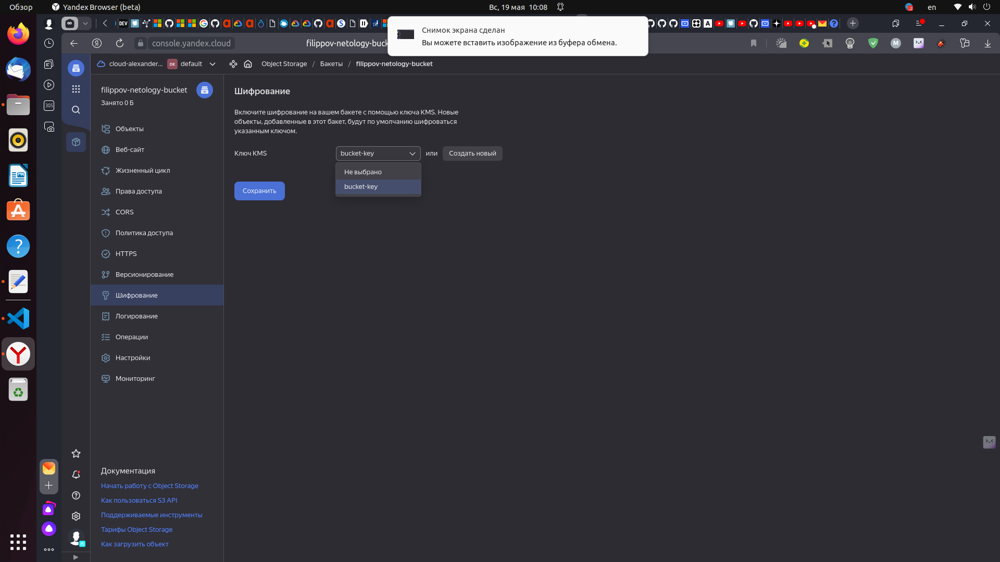

# Домашнее задание к занятию «Безопасность в облачных провайдерах»  

Используя конфигурации, выполненные в рамках предыдущих домашних заданий, нужно добавить возможность шифрования бакета.

---
## Задание 1. Yandex Cloud   

1. С помощью ключа в KMS необходимо зашифровать содержимое бакета:

 - создать ключ в KMS;
 - с помощью ключа зашифровать содержимое бакета, созданного ранее.
2. (Выполняется не в Terraform)* Создать статический сайт в Object Storage c собственным публичным адресом и сделать доступным по HTTPS:

 - создать сертификат;
 - создать статическую страницу в Object Storage и применить сертификат HTTPS;
 - в качестве результата предоставить скриншот на страницу с сертификатом в заголовке (замочек).

Полезные документы:

- [Настройка HTTPS статичного сайта](https://cloud.yandex.ru/docs/storage/operations/hosting/certificate).
- [Object Storage bucket](https://registry.terraform.io/providers/yandex-cloud/yandex/latest/docs/resources/storage_bucket).
- [KMS key](https://registry.terraform.io/providers/yandex-cloud/yandex/latest/docs/resources/kms_symmetric_key).


1. Вносим правки в код Terraform для создания бакета из предыдущего задания для выполнения шифрования с помощью ключа KMS:

```
// Create SA
resource "yandex_iam_service_account" "sa-bucket" {
    name      = "sa-for-bucket"
}

// Grant permissions
resource "yandex_resourcemanager_folder_iam_member" "bucket-editor" {
    folder_id = var.folder_id
    role      = "storage.editor"
    member    = "serviceAccount:${yandex_iam_service_account.sa-bucket.id}"
    depends_on = [yandex_iam_service_account.sa-bucket]
}

// Create Static Access Keys
resource "yandex_iam_service_account_static_access_key" "sa-static-key" {
    service_account_id = yandex_iam_service_account.sa-bucket.id
    description        = "static access key for bucket"
    depends_on = [yandex_iam_service_account.sa-bucket]
}

// Create bucket-key
resource "yandex_kms_symmetric_key" "bucket-key" {
  name = "bucket-key"
  description       = "Key for object storage encryption"
  default_algorithm = "AES_128" # Алгоритм шифрования. Возможные значения: AES-128, AES-192 или AES-256.
  rotation_period   = "8760h"   # 1 год. Период ротации (частота смены версии ключа по умолчанию).
}


// Use keys to create bucket
resource "yandex_storage_bucket" "filippov-netology-bucket" {
    access_key = yandex_iam_service_account_static_access_key.sa-static-key.access_key
    secret_key = yandex_iam_service_account_static_access_key.sa-static-key.secret_key
    depends_on = [yandex_iam_service_account_static_access_key.sa-static-key]
    bucket = "filippov-netology-bucket"
    acl    = "public-read"
 
    server_side_encryption_configuration {
      rule {
        apply_server_side_encryption_by_default {
          kms_master_key_id = yandex_kms_symmetric_key.bucket-key.id
          sse_algorithm     = "aws:kms"
      }
    }
  }   
}

// Add picture to bucket
resource "yandex_storage_object" "object-1" {
    depends_on = [yandex_iam_service_account_static_access_key.sa-static-key]
    access_key = yandex_iam_service_account_static_access_key.sa-static-key.access_key
    secret_key = yandex_iam_service_account_static_access_key.sa-static-key.secret_key
    bucket = yandex_storage_bucket.filippov-netology-bucket.bucket
    key = "test_pic.jpg"
    content_type = "image/jpeg"
    source = "data/test_pic.jpg"
    acl    = "public-read"
}


resource "local_file" "index_html" {
  content = templatefile("${abspath(path.module)}/web-app.tftpl",
    {
      bucket = yandex_storage_bucket.filippov-netology-bucket
      object = yandex_storage_object.object-1
    }
  )
  filename = "${abspath(path.module)}/../data/index.html"
}

resource "yandex_storage_object" "index_html" {
    depends_on = [yandex_iam_service_account_static_access_key.sa-static-key]
    access_key = yandex_iam_service_account_static_access_key.sa-static-key.access_key
    secret_key = yandex_iam_service_account_static_access_key.sa-static-key.secret_key
    bucket = yandex_storage_bucket.filippov-netology-bucket.bucket
    key = "index.html"
    source = local_file.index_html.filename
    acl    = "public-read"
}
```

2. Выполняем код Terraform:

```
aleksander@aleksander-MS-7641:~/clopro-homeworks/security/terraform$ terraform apply
var.cloud_id
  b1gfboajr02kesda5lgl

  Enter a value: b1gfboajr02kesda5lgl

var.folder_id
  b1g7kr9i41eoi2fqj52o

  Enter a value: b1g7kr9i41eoi2fqj52o

var.token
  Enter a value: 

yandex_kms_symmetric_key.bucket-key: Refreshing state... [id=abj2np1o1fs9cp1bu1mg]
yandex_iam_service_account.sa-bucket: Refreshing state... [id=ajena8vpq9tsb8ck5bnf]
yandex_resourcemanager_folder_iam_member.bucket-editor: Refreshing state... [id=b1g7kr9i41eoi2fqj52o/storage.editor/serviceAccount:ajena8vpq9tsb8ck5bnf]
yandex_iam_service_account_static_access_key.sa-static-key: Refreshing state... [id=ajeeksrpqvbtt0rs6pfp]
yandex_storage_bucket.filippov-netology-bucket: Refreshing state... [id=filippov-netology-bucket]

Terraform used the selected providers to generate the following execution plan. Resource actions are indicated with the following symbols:
  + create
  ~ update in-place

Terraform will perform the following actions:

  # local_file.index_html will be created
  + resource "local_file" "index_html" {
      + content              = (sensitive value)
      + content_base64sha256 = (known after apply)
      + content_base64sha512 = (known after apply)
      + content_md5          = (known after apply)
      + content_sha1         = (known after apply)
      + content_sha256       = (known after apply)
      + content_sha512       = (known after apply)
      + directory_permission = "0777"
      + file_permission      = "0777"
      + filename             = "/home/aleksander/clopro-homeworks/security/terraform/../data/index.html"
      + id                   = (known after apply)
    }

  # yandex_kms_symmetric_key.bucket-key will be updated in-place
  ~ resource "yandex_kms_symmetric_key" "bucket-key" {
      - description         = "Key for object storage encryption" -> null
        id                  = "abj2np1o1fs9cp1bu1mg"
        name                = "bucket-key"
      - rotation_period     = "8760h0m0s" -> null
        # (6 unchanged attributes hidden)
    }

  # yandex_storage_bucket.filippov-netology-bucket will be updated in-place
  ~ resource "yandex_storage_bucket" "filippov-netology-bucket" {
        id                    = "filippov-netology-bucket"
        tags                  = {}
        # (9 unchanged attributes hidden)

      - server_side_encryption_configuration {
          - rule {
              - apply_server_side_encryption_by_default {
                  - kms_master_key_id = "abj2np1o1fs9cp1bu1mg" -> null
                  - sse_algorithm     = "aws:kms" -> null
                }
            }
        }

        # (2 unchanged blocks hidden)
    }

  # yandex_storage_object.index_html will be created
  + resource "yandex_storage_object" "index_html" {
      + access_key   = "YCAJEMCC81Hmh0KVP7sfXYOv3"
      + acl          = "public-read"
      + bucket       = "filippov-netology-bucket"
      + content_type = (known after apply)
      + id           = (known after apply)
      + key          = "index.html"
      + secret_key   = (sensitive value)
      + source       = "/home/aleksander/clopro-homeworks/security/terraform/../data/index.html"
    }

  # yandex_storage_object.object-1 will be created
  + resource "yandex_storage_object" "object-1" {
      + access_key   = "YCAJEMCC81Hmh0KVP7sfXYOv3"
      + acl          = "public-read"
      + bucket       = "filippov-netology-bucket"
      + content_type = "image/jpeg"
      + id           = (known after apply)
      + key          = "test_pic.jpg"
      + secret_key   = (sensitive value)
      + source       = "data/test_pic.jpg"
    }

Plan: 3 to add, 2 to change, 0 to destroy.

Do you want to perform these actions?
  Terraform will perform the actions described above.
  Only 'yes' will be accepted to approve.

  Enter a value: yes

yandex_kms_symmetric_key.bucket-key: Modifying... [id=abj2np1o1fs9cp1bu1mg]
yandex_storage_bucket.filippov-netology-bucket: Modifying... [id=filippov-netology-bucket]
yandex_kms_symmetric_key.bucket-key: Modifications complete after 1s [id=abj2np1o1fs9cp1bu1mg]
yandex_storage_bucket.filippov-netology-bucket: Modifications complete after 1s [id=filippov-netology-bucket]
yandex_storage_object.object-1: Creating...
yandex_storage_object.object-1: Creation complete after 1s [id=test_pic.jpg]
local_file.index_html: Creating...
local_file.index_html: Creation complete after 0s [id=25f737490ed8fa48924dce2f2ef8d2fc52c3a9b6]
yandex_storage_object.index_html: Creating...
yandex_storage_object.index_html: Creation complete after 0s [id=index.html]

Apply complete! Resources: 3 added, 2 changed, 0 destroyed.

Outputs:

yandex_storage_object_index_html_url = "https://filippov-netology-bucket.storage.yandexcloud.net/index.html"
yandex_storage_object_object-1_url = "https://filippov-netology-bucket.storage.yandexcloud.net/test_pic.jpg"
aleksander@aleksander-MS-7641:~/clopro-homeworks/security/terraform$ terraform apply
var.cloud_id
  b1gfboajr02kesda5lgl

  Enter a value: b1gfboajr02kesda5lgl

var.folder_id
  b1g7kr9i41eoi2fqj52o

  Enter a value: b1g7kr9i41eoi2fqj52o

var.token
  Enter a value: 

yandex_iam_service_account.sa-bucket: Refreshing state... [id=ajena8vpq9tsb8ck5bnf]
yandex_kms_symmetric_key.bucket-key: Refreshing state... [id=abj2np1o1fs9cp1bu1mg]
yandex_resourcemanager_folder_iam_member.bucket-editor: Refreshing state... [id=b1g7kr9i41eoi2fqj52o/storage.editor/serviceAccount:ajena8vpq9tsb8ck5bnf]
yandex_iam_service_account_static_access_key.sa-static-key: Refreshing state... [id=ajeeksrpqvbtt0rs6pfp]
yandex_storage_bucket.filippov-netology-bucket: Refreshing state... [id=filippov-netology-bucket]
yandex_storage_object.object-1: Refreshing state... [id=test_pic.jpg]
local_file.index_html: Refreshing state... [id=25f737490ed8fa48924dce2f2ef8d2fc52c3a9b6]
yandex_storage_object.index_html: Refreshing state... [id=index.html]

Terraform used the selected providers to generate the following execution plan. Resource actions are indicated with the following symbols:
  ~ update in-place

Terraform will perform the following actions:

  # yandex_storage_bucket.filippov-netology-bucket will be updated in-place
  ~ resource "yandex_storage_bucket" "filippov-netology-bucket" {
        id                    = "filippov-netology-bucket"
        tags                  = {}
        # (9 unchanged attributes hidden)

      + server_side_encryption_configuration {
          + rule {
              + apply_server_side_encryption_by_default {
                  + kms_master_key_id = "abj2np1o1fs9cp1bu1mg"
                  + sse_algorithm     = "aws:kms"
                }
            }
        }

        # (2 unchanged blocks hidden)
    }

Plan: 0 to add, 1 to change, 0 to destroy.

Do you want to perform these actions?
  Terraform will perform the actions described above.
  Only 'yes' will be accepted to approve.

  Enter a value: yes

yandex_storage_bucket.filippov-netology-bucket: Modifying... [id=filippov-netology-bucket]
yandex_storage_bucket.filippov-netology-bucket: Modifications complete after 2s [id=filippov-netology-bucket]

Apply complete! Resources: 0 added, 1 changed, 0 destroyed.

Outputs:

yandex_storage_object_index_html_url = "https://filippov-netology-bucket.storage.yandexcloud.net/index.html"
yandex_storage_object_object-1_url = "https://filippov-netology-bucket.storage.yandexcloud.net/test_pic.jpg"
aleksander@aleksander-MS-7641:~/clopro-homeworks/security/terraform$ terraform apply
var.cloud_id
  b1gfboajr02kesda5lgl

  Enter a value: b1gfboajr02kesda5lgl

var.folder_id
  b1g7kr9i41eoi2fqj52o

  Enter a value: b1g7kr9i41eoi2fqj52o

var.token
  Enter a value: 

yandex_iam_service_account.sa-bucket: Refreshing state... [id=ajena8vpq9tsb8ck5bnf]
yandex_kms_symmetric_key.bucket-key: Refreshing state... [id=abj2np1o1fs9cp1bu1mg]
yandex_resourcemanager_folder_iam_member.bucket-editor: Refreshing state... [id=b1g7kr9i41eoi2fqj52o/storage.editor/serviceAccount:ajena8vpq9tsb8ck5bnf]
yandex_iam_service_account_static_access_key.sa-static-key: Refreshing state... [id=ajeeksrpqvbtt0rs6pfp]
yandex_storage_bucket.filippov-netology-bucket: Refreshing state... [id=filippov-netology-bucket]
yandex_storage_object.object-1: Refreshing state... [id=test_pic.jpg]
local_file.index_html: Refreshing state... [id=25f737490ed8fa48924dce2f2ef8d2fc52c3a9b6]
yandex_storage_object.index_html: Refreshing state... [id=index.html]

Terraform used the selected providers to generate the following execution plan. Resource actions are indicated with the following symbols:
  ~ update in-place

Terraform will perform the following actions:

  # yandex_kms_symmetric_key.bucket-key will be updated in-place
  ~ resource "yandex_kms_symmetric_key" "bucket-key" {
      + description         = "Key for object storage encryption"
        id                  = "abj2np1o1fs9cp1bu1mg"
        name                = "bucket-key"
      + rotation_period     = "8760h"
        # (6 unchanged attributes hidden)
    }

Plan: 0 to add, 1 to change, 0 to destroy.

Do you want to perform these actions?
  Terraform will perform the actions described above.
  Only 'yes' will be accepted to approve.

  Enter a value: yes

yandex_kms_symmetric_key.bucket-key: Modifying... [id=abj2np1o1fs9cp1bu1mg]
yandex_kms_symmetric_key.bucket-key: Modifications complete after 1s [id=abj2np1o1fs9cp1bu1mg]

Apply complete! Resources: 0 added, 1 changed, 0 destroyed.

Outputs:

yandex_storage_object_index_html_url = "https://filippov-netology-bucket.storage.yandexcloud.net/index.html"
yandex_storage_object_object-1_url = "https://filippov-netology-bucket.storage.yandexcloud.net/test_pic.jpg"
```

3. Результат выполнения:

<p align="center">
  
</p>


--- 
## Задание 2*. AWS (задание со звёздочкой)

Это необязательное задание. Его выполнение не влияет на получение зачёта по домашней работе.

**Что нужно сделать**

1. С помощью роли IAM записать файлы ЕС2 в S3-бакет:
 - создать роль в IAM для возможности записи в S3 бакет;
 - применить роль к ЕС2-инстансу;
 - с помощью bootstrap-скрипта записать в бакет файл веб-страницы.
2. Организация шифрования содержимого S3-бакета:

 - используя конфигурации, выполненные в домашнем задании из предыдущего занятия, добавить к созданному ранее бакету S3 возможность шифрования Server-Side, используя общий ключ;
 - включить шифрование SSE-S3 бакету S3 для шифрования всех вновь добавляемых объектов в этот бакет.

3. *Создание сертификата SSL и применение его к ALB:

 - создать сертификат с подтверждением по email;
 - сделать запись в Route53 на собственный поддомен, указав адрес LB;
 - применить к HTTPS-запросам на LB созданный ранее сертификат.

Resource Terraform:

- [IAM Role](https://registry.terraform.io/providers/hashicorp/aws/latest/docs/resources/iam_role).
- [AWS KMS](https://registry.terraform.io/providers/hashicorp/aws/latest/docs/resources/kms_key).
- [S3 encrypt with KMS key](https://registry.terraform.io/providers/hashicorp/aws/latest/docs/resources/s3_bucket_object#encrypting-with-kms-key).

Пример bootstrap-скрипта:

```
#!/bin/bash
yum install httpd -y
service httpd start
chkconfig httpd on
cd /var/www/html
echo "<html><h1>My cool web-server</h1></html>" > index.html
aws s3 mb s3://mysuperbacketname2021
aws s3 cp index.html s3://mysuperbacketname2021
```

### Правила приёма работы

Домашняя работа оформляется в своём Git репозитории в файле README.md. Выполненное домашнее задание пришлите ссылкой на .md-файл в вашем репозитории.
Файл README.md должен содержать скриншоты вывода необходимых команд, а также скриншоты результатов.
Репозиторий должен содержать тексты манифестов или ссылки на них в файле README.md.
